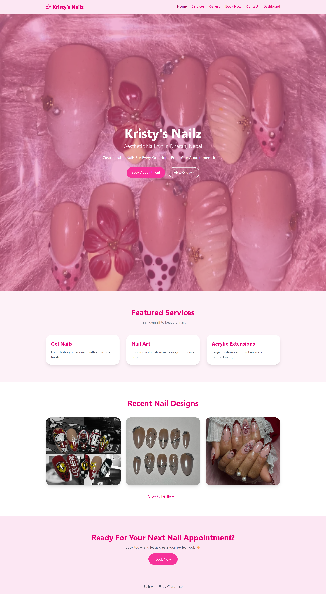
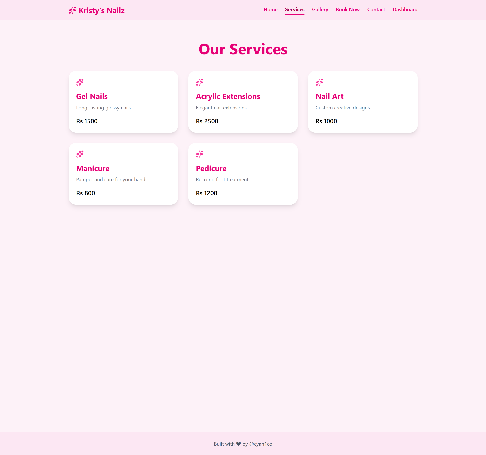
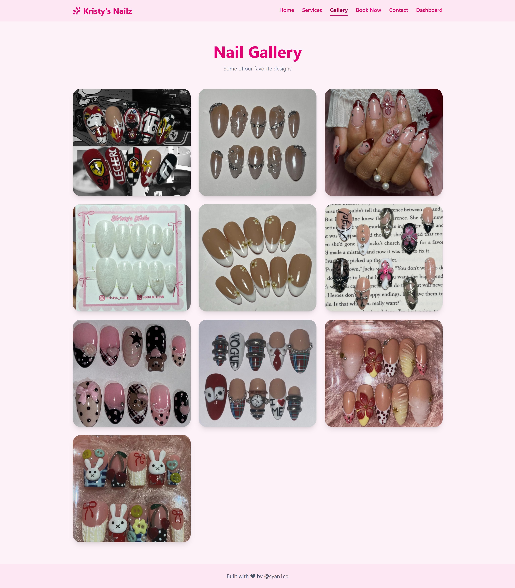
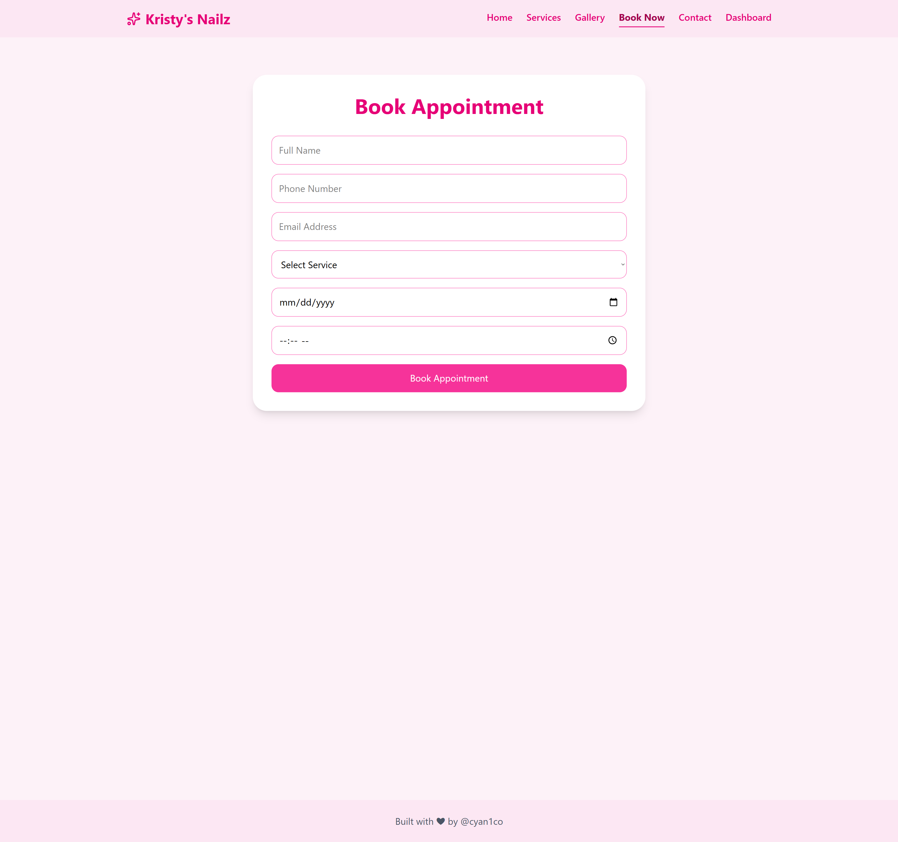
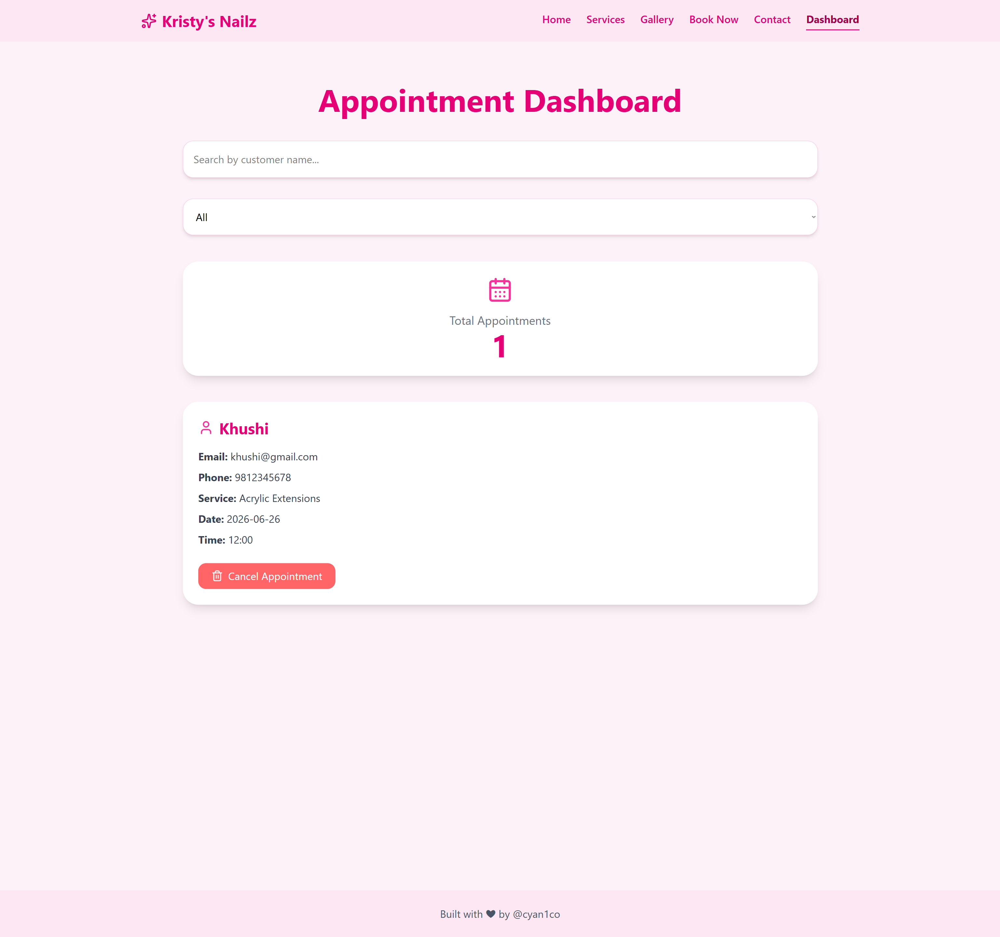

# Nail Appointment System

A modern React-based nail salon website featuring appointment booking, gallery showcase, service listings, and appointment management.

## Features

* Multi-page React application using React Router
* Responsive navigation bar
* Service showcase page
* Nail design gallery
* Appointment booking form
* Appointment dashboard
* Search appointments by customer name
* Filter appointments by service
* Local Storage integration for saving appointments
* Mobile-friendly design
* Tailwind CSS styling

## Built With

* React
* React Router
* Tailwind CSS
* Lucide React Icons
* Vite

## Screenshots

* Home Page

* Services Page

* Gallery Page

* Booking Page

* Dashboard

## Live Demo

https://nail-appointment-system-liard.vercel.app

## Future Improvements

* Backend database integration
* Email appointment confirmations
* Online payment system
* Admin authentication
* Real-time appointment management

## Author

Khushi Limbu
